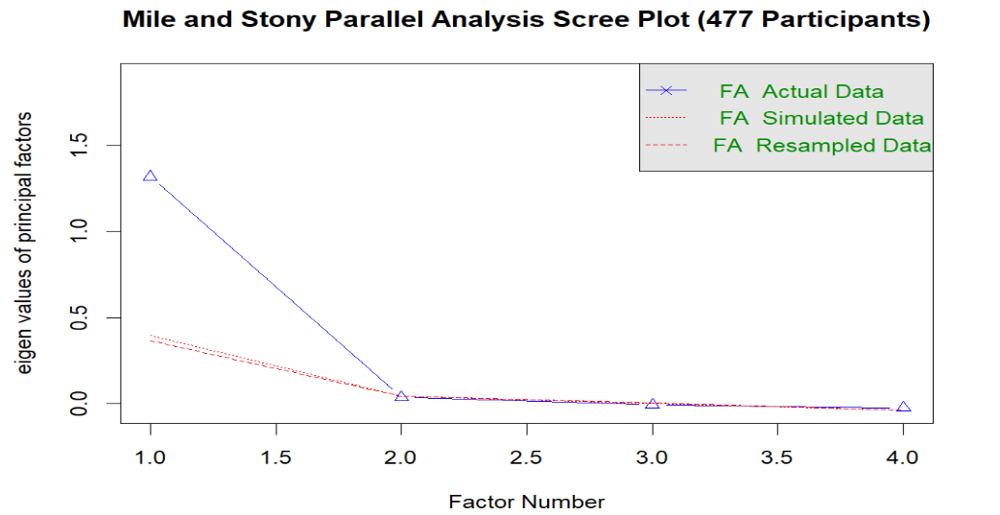
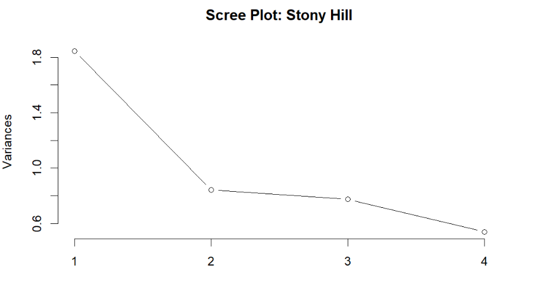
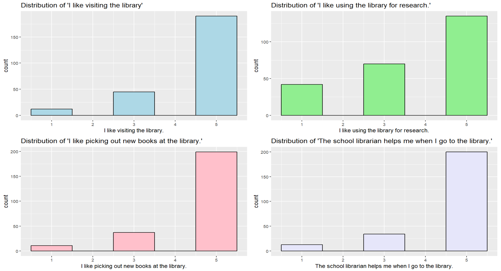

# 📚 Psychometric Analysis of Library Engagement Survey

**Author:** Nandni Talreja  
**Affiliation:** UMass Amherst | Center for Education Policy  
**Supervisor:** Prof. Peter Piazza  
**Date:** September 2024 - Present

---

## 🧠 Overview

This project applies psychometric methods to analyze a library engagement survey distributed among K–12 students and teachers in Massachusetts school districts. Due to privacy restrictions, raw data and internal reports are not shared, but the full code and visual outputs are provided for reproducibility and learning purposes.

---

## 🛠️ Tools & Methods

- R (ggplot2, psych, corrplot, etc.)
- Descriptive Stats
- Cronbach's Alpha
- Exploratory Factor Analysis (EFA)
- Principal Component Analysis (PCA)
- Correlation Matrix

---

## 📁 Project Contents

| Folder      | Description |
|-------------|-------------|
| `/analysis` | R Markdown file with full psychometric workflow |
| `/scripts`  | Supporting scripts for data cleaning |
| `/visuals`  | Correlation plots, factor loadings, histograms |

---

## 📊 Sample Visuals

---

## 📝 Notes

- The original data includes responses from ~375 students across grades K–12.
- Survey items captured student attitudes toward library visits, book selection, librarian support, and research use.
- Full analysis includes factor identification, reliability testing, and thematic trends.

---

## 🔒 Disclaimer

Raw survey data and internal documentation are not included due to privacy and project confidentiality agreements.

---

## 📬 Contact

For questions or collaborations:
📧 talrejanandni.da@gmail.com 
